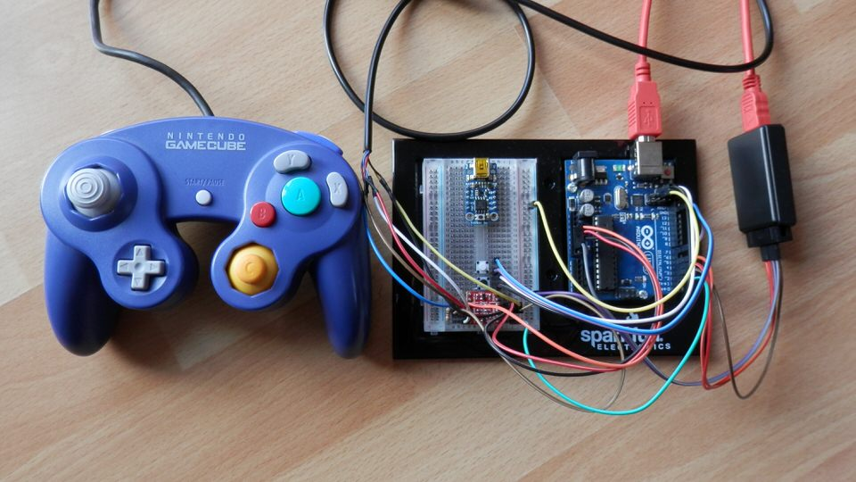

Arduino Nintendo Library 1.2.1
==============================



This library is made to connect Nintendo Controllers to your Arduino very easy.
Make sure you grab the right hardware, tear off some cables to use your controllers
on your PC for example. The requirement are written in each library readme part.

**IDE 1.6 compatible!**

##### Supported devices
Host mode means that you can hook up an controller to your Arduino and read its buttons.
Controller mode means that your Arduino can act as controller.
**N64 Controller was tested with an older API. I updated the API, but had no
chance to test it again. Tell me if your N64 Controller works.**

* GamecubeConsole (Device Mode)
* GamecubeController (Host Mode)
* N64Controller (Host Mode)

##### Planned features
* N64Console (todo, don't have any)
* Wii-Mote (USB Host shield)
* Wii Nunchuk (I2C)
* Wii Classic Controller (I2C)
* Wii-Mote plus(USB Host shield)
* Wiiu Pro Controller (USB Host shield)
* SNES Controller (I don't have any)

##### Todo:
* N64 rumble -> example
* N64 -> USB example
* GC to N64 example

##### Possible projects:
* Gamecube HID Controller
* Gamecube to X Adapter
* X to Gamecube Adapter
* Selfmade Gamecube Controller
* Wireless Gamecube Controller
* 2 Player merged Controller
* Manipulated (shortcut) Gamecube Controller
* Gamecube Controller as Arduino input

Download
========

Download the zip, extract and remove the "-master" of the folder.
Install the library [as described here](http://arduino.cc/en/pmwiki.php?n=Guide/Libraries).
You can also use the Arduino Library Manager to get the latest version.

Checkout the ['dev' branch](https://github.com/NicoHood/Nintendo/tree/dev) to test the bleeding edge of this software. It might now work at all or has a lot of debugging stuff in it.

Wiki
====

All documentation moved to the [wiki page](https://github.com/NicoHood/Nintendo/wiki).

Contact
=======

Contact information can be found here:

www.nicohood.de


Version History
===============
```
1.2.1 Release (27.01.2017)
* Fix compiling of assembler functions

1.2 Release (19.07.2016)
* Reworked library structure
* Added N64Controller support
* Added GamecubeConsole support
* Separated consoles
* Added library.properties
* Added version identifier
* Untabified all source files

1.1 Release (14.02.2015)
* Changes in the Gamecube Code:
 * Hardcoded all get/send functions with assembler
 * Now with all IDE versions compatible
 * Improved pin management/ram usage
 * Multiple controllers possible
 * Improved end() function
 * Added new begin() function overload
 * Improved example
 * Updated HID Project example to version 2.1
 * Updated structs
* Moved documentation to the Wiki

1.0 Release (01.07.2014)
* Added Gamecube Device support
```

License and Copyright
=====================
If you use this library for any cool project let me know!

```
Copyright (c) 2014-2016 NicoHood
See the readme for credit to other people.

Permission is hereby granted, free of charge, to any person obtaining a copy
of this software and associated documentation files (the "Software"), to deal
in the Software without restriction, including without limitation the rights
to use, copy, modify, merge, publish, distribute, sublicense, and/or sell
copies of the Software, and to permit persons to whom the Software is
furnished to do so, subject to the following conditions:

The above copyright notice and this permission notice shall be included in
all copies or substantial portions of the Software.

THE SOFTWARE IS PROVIDED "AS IS", WITHOUT WARRANTY OF ANY KIND, EXPRESS OR
IMPLIED, INCLUDING BUT NOT LIMITED TO THE WARRANTIES OF MERCHANTABILITY,
FITNESS FOR A PARTICULAR PURPOSE AND NONINFRINGEMENT. IN NO EVENT SHALL THE
AUTHORS OR COPYRIGHT HOLDERS BE LIABLE FOR ANY CLAIM, DAMAGES OR OTHER
LIABILITY, WHETHER IN AN ACTION OF CONTRACT, TORT OR OTHERWISE, ARISING FROM,
OUT OF OR IN CONNECTION WITH THE SOFTWARE OR THE USE OR OTHER DEALINGS IN
THE SOFTWARE.
```
