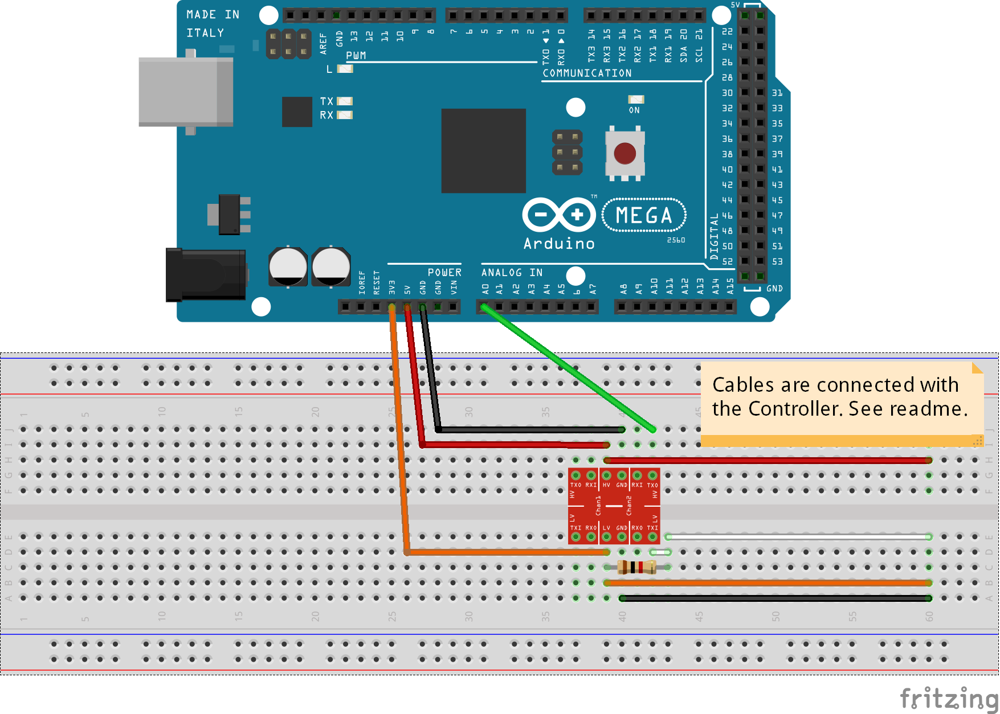
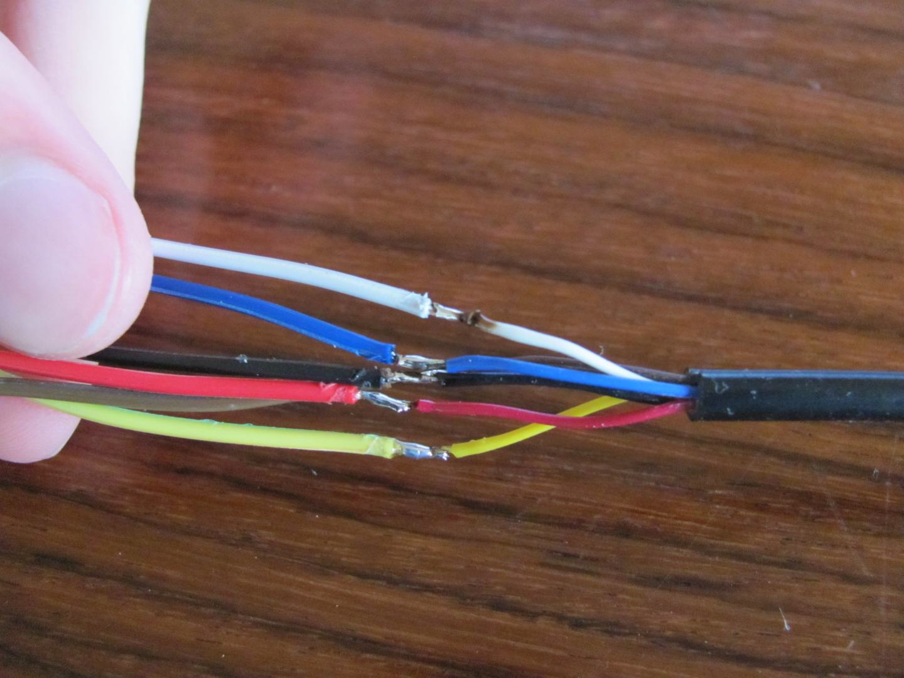

Arduino Nintendo Library
========================

This library is made to connect Nintendo Controllers to your Arduino very easy.
Make sure you grab the right hardware, tear off some cables and use your controllers
on your PC for example. This requires a 16MHZ Arduino.

**The library supports the following devices:**
* Gamecube Controller
* Gamecube Host(todo)
* N64 Controller (todo)
* N64 Host(todo)

**These examples come with the library:**
* Gamecube_Print prints GC controller status to your Serial
* Gamecube_USB_HID makes your GC controller usable on pc. Requires [HID Project](https://github.com/NicoHood/HID).

**These features are planned (Wii stuff with USB Host shield or I2C):**
* Wii-Mote
* Wii Nunchuk
* Wii Classic Controller
* Wii-Mote plus
* Wiiu Pro Controller
* SNES Controller (I dont have any right now)

Gamecube Controller Setup
=========================

The Gamecube controller uses 3.3V Logic, 3.3V Power and 5V rumble Power.
**Make sure to use a logic level converter to not burn your controller.**
A 1k resistor on the 3.3V side is recommended to pullup the line. See schematic.

You better get an extension cable and cut it half. I used a lioncast cable and the colors were:
**Colors of my extension cable, can be different to yours!**
See folder development for more information/links below
```
1 Yellow: 5V
2 White:  Data
3 Red:    Gnd
4 Brown:  Gnd
5 Green:  NC
6 Blue:   3.3V
7 Black:  Gnd
 ```
 
 
 

How does it work
================
Gamecube:
---------
Here is just refer to the other documentations, its explained pretty good.
What i did was to mess around with this some more and integrated easy user access.
This wouldnt be possible without the work of other people (below) and a logic analyzer.
Gamecube tested about 60minutes with 2 reading errors (of some million). Should work stable.

How to get assembler output:
```
 E:\Arduino\arduino-1.5.6-r2\hardware\tools\avr\bin\avr-objdump -S C:\Users\Testuser\AppData\Local\Temp\build8182289464639461553.tmp\GamecubeController13.cpp.elf > E:\RCChannels.dmp
```
http://rcarduino.blogspot.de/2012/09/how-to-view-arduino-assembly.html

http://www.atmel.com/Images/doc0856.pdf

This library wouldnt be possible without
========================================
* [brownan's N64 to Gamecube Controller Adapter](https://github.com/brownan/Gamecube-N64-Controller)
* [Salae Logic](https://www.saleae.com/logic)
* [Yet Another Gamecube Documentation](http://hitmen.c02.at/files/yagcd/yagcd/chap9.html)
* [Nintendo Gamecube Controller Pinout](http://www.int03.co.uk/crema/hardware/gamecube/gc-control.htm)
* [HID Project](https://github.com/NicoHood/HID)

Contact me via my blog:
http://nicohood.wordpress.com/

Known Bugs
==========
**This might not work with newer IDE versions or different compilers (for Gamecube/N64).**
This is because of the very critical timing and the inline assembler with nops.
Arduino IDE 1.0.5 and 1.5.6-r2 do work!

Ports next to the input can crosstalk maybe. This should be 0.2uS or so, not really important.
But this is a general hardware bug of the AVR uCs. Just want to note that.

Version History
===============
```
1.0 Release (01.07.2014)
* Added Gamecube Device support
```

Licence and Copyright
=====================
If you use this library for any cool project let me know!

```
Copyright (c) 2014 NicoHood
See the readme for credit to other people.

Permission is hereby granted, free of charge, to any person obtaining a copy
of this software and associated documentation files (the "Software"), to deal
in the Software without restriction, including without limitation the rights
to use, copy, modify, merge, publish, distribute, sublicense, and/or sell
copies of the Software, and to permit persons to whom the Software is
furnished to do so, subject to the following conditions:

The above copyright notice and this permission notice shall be included in
all copies or substantial portions of the Software.

THE SOFTWARE IS PROVIDED "AS IS", WITHOUT WARRANTY OF ANY KIND, EXPRESS OR
IMPLIED, INCLUDING BUT NOT LIMITED TO THE WARRANTIES OF MERCHANTABILITY,
FITNESS FOR A PARTICULAR PURPOSE AND NONINFRINGEMENT. IN NO EVENT SHALL THE
AUTHORS OR COPYRIGHT HOLDERS BE LIABLE FOR ANY CLAIM, DAMAGES OR OTHER
LIABILITY, WHETHER IN AN ACTION OF CONTRACT, TORT OR OTHERWISE, ARISING FROM,
OUT OF OR IN CONNECTION WITH THE SOFTWARE OR THE USE OR OTHER DEALINGS IN
THE SOFTWARE.
```