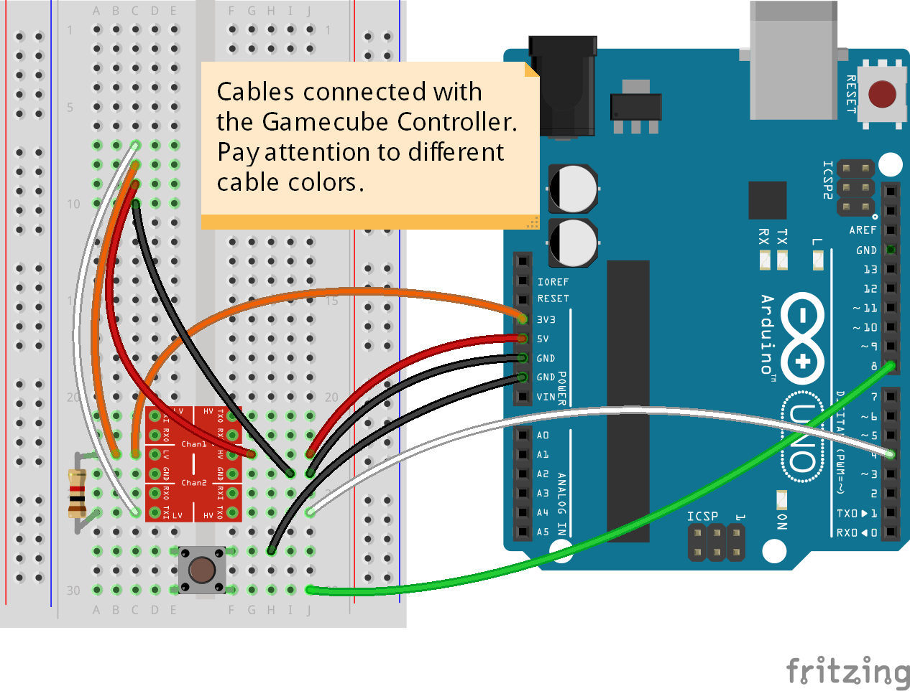

Arduino Nintendo Library 1.1
============================

This library is made to connect Nintendo Controllers to your Arduino very easy.
Make sure you grab the right hardware, tear off some cables and use your controllers
on your PC for example. This requires a 16MHZ Arduino.

**IDE 1.6 compatible!**

**The library supports the following devices:**
* Gamecube Controller
* Gamecube Host(todo)
* N64 Controller (todo)
* N64 Host(todo)

**These examples come with the library:**
* Gamecube_Print prints GC controller status to your Serial
* Gamecube_USB_HID makes your GC controller usable on pc. Requires [HID Project](https://github.com/NicoHood/HID).

**These features are planned (Wii stuff with USB Host shield or I2C):**
* Wii-Mote
* Wii Nunchuk
* Wii Classic Controller
* Wii-Mote plus
* Wiiu Pro Controller
* SNES Controller (I dont have any right now)

Gamecube Controller
===================

### Hardware setup

The Gamecube controller uses 3.3V Logic, 3.3V Power and 5V rumble Power.
**Make sure to use a logic level converter to not burn your controller.**
A 1k resistor on the 3.3V side is recommended to pullup the line. See schematic.

The rumble draws about 30mA from what I've measured.
Using the In/Output method will cause weird delay in the sending and the pulse is 2cycles off sometimes.
Currently the library only works for 16MHz, but 20MHz could be possible and 8MHz with some tricks.

You better get an extension cable and cut it half. I used a lioncast cable and the colors were
**(can be different to yours!)**:
```
1 Yellow: 5V
2 White:  Data
3 Red:    Gnd
4 Brown:  Gnd
5 Green:  NC
6 Blue:   3.3V
7 Black:  Gnd
 ```
 
 
 
 Cut the extension cable and solder some wires. Make sure they don't connect with each other like in the picture.
 
 

### Software

Checkout the examples on how to access and initialize the controller.

#####bool begin(const uint8_t pin, Gamecube_Status_t &status)
Initializes the controller and updates the passed in status report.
The status report tells you the controller type and the rumble state.
Normally you don't have to do this, but for a Wavebird Controller it seems to be necessary.
Returns true if initialization was successful, otherwise false.

#####bool end(const uint8_t pin)
Sends a rumble off signal to the controller and discards any incoming data.
Mainly does the same as read, but discards the data.
Returns true if operation was successful, otherwise false.

#####bool read(const uint8_t pin, Gamecube_Data_t &report, const bool rumble = false)
Reads in the new controller state to the passed in report.
Rumble will be turned on/off by the passed in bool.
If you don't pass the rumble boot it, it will by default not rumble.
Returns true if reading was successful, otherwise false.
If it fails, it still might have updated some bytes of the report.

#####Gamecube_Data_t
```cpp
typedef union{
	// 8 bytes of datareport that we get from the controller
	uint8_t whole8[];
	uint16_t whole16[];
	uint32_t whole32[];

	struct{
		uint8_t buttons1;
		uint8_t buttons2;
	};

	struct {
		// first data byte (bitfields are sorted in LSB order)
		uint8_t a : 1;
		uint8_t b : 1;
		uint8_t x : 1;
		uint8_t y : 1;
		uint8_t start : 1;
		uint8_t low0 : 1;
		uint8_t low1 : 1;
		uint8_t low2 : 1;

		// second data byte
		uint8_t dleft : 1;
		uint8_t dright : 1;
		uint8_t ddown : 1;
		uint8_t dup : 1;
		uint8_t z : 1;
		uint8_t r : 1;
		uint8_t l : 1;
		uint8_t high0 : 1;

		// 3rd-8th data byte
		uint8_t xAxis;
		uint8_t yAxis;
		uint8_t cxAxis;
		uint8_t cyAxis;
		uint8_t left;
		uint8_t right;
	};
} Gamecube_Data_t;
```

#####Gamecube_Status_t
```cpp
typedef union{
	// 3 bytes of statusreport that we get from the controller
	uint8_t whole8[];
	uint16_t whole16[];
	struct {
		// device information
		uint16_t device;

		// controller status (only rumble is known)
		uint8_t status0 : 3;
		uint8_t rumble : 1;
		uint8_t status1 : 4;
	};
} Gamecube_Status_t;
```

###Protocol information

How does it work
================
Gamecube:
---------
Here is just refer to the other documentations, its explained pretty good.
What I did was to mess around with this some more and integrated easy user access.
This wouldnt be possible without the work of other people (below) and a logic analyzer.
Gamecube tested about 60minutes with 2 reading errors (of some million). Should work stable.

How to get assembler output:
```
 E:\Arduino\arduino-1.5.6-r2\hardware\tools\avr\bin\avr-objdump -S C:\Users\Testuser\AppData\Local\Temp\build8182289464639461553.tmp\GamecubeController13.cpp.elf > E:\RCChannels.dmp
```
http://rcarduino.blogspot.de/2012/09/how-to-view-arduino-assembly.html

http://www.atmel.com/Images/doc0856.pdf

This library wouldnt be possible without
========================================
* [brownan's N64 to Gamecube Controller Adapter](https://github.com/brownan/Gamecube-N64-Controller)
* [Salae Logic](https://www.saleae.com/logic)
* [Yet Another Gamecube Documentation](http://hitmen.c02.at/files/yagcd/yagcd/chap9.html)
* [Nintendo Gamecube Controller Pinout](http://www.int03.co.uk/crema/hardware/gamecube/gc-control.htm)
* [HID Project](https://github.com/NicoHood/HID)

Contact me via my blog:
http://nicohood.de/

Known Bugs
==========

Ports next to the input can crosstalk maybe. This should be 0.2uS or so, not really important.
But this is a general hardware bug of the AVR uCs. Just want to note that.

Version History
===============
```
1.1 Release (02.xx.2015)
* Changes in the Gamecube Code:
 * Hardcoded all get/send functions with assembler
 * Now with all IDE versions compatible
 * Improved pin management/ram usage
 * Multiple controllers possible
 * Improved end() functions
 * Improved example
 * Updated HID Project example to version 2.1

1.0 Release (01.07.2014)
* Added Gamecube Device support
```

Licence and Copyright
=====================
If you use this library for any cool project let me know!

```
Copyright (c) 2014-2015 NicoHood
See the readme for credit to other people.

Permission is hereby granted, free of charge, to any person obtaining a copy
of this software and associated documentation files (the "Software"), to deal
in the Software without restriction, including without limitation the rights
to use, copy, modify, merge, publish, distribute, sublicense, and/or sell
copies of the Software, and to permit persons to whom the Software is
furnished to do so, subject to the following conditions:

The above copyright notice and this permission notice shall be included in
all copies or substantial portions of the Software.

THE SOFTWARE IS PROVIDED "AS IS", WITHOUT WARRANTY OF ANY KIND, EXPRESS OR
IMPLIED, INCLUDING BUT NOT LIMITED TO THE WARRANTIES OF MERCHANTABILITY,
FITNESS FOR A PARTICULAR PURPOSE AND NONINFRINGEMENT. IN NO EVENT SHALL THE
AUTHORS OR COPYRIGHT HOLDERS BE LIABLE FOR ANY CLAIM, DAMAGES OR OTHER
LIABILITY, WHETHER IN AN ACTION OF CONTRACT, TORT OR OTHERWISE, ARISING FROM,
OUT OF OR IN CONNECTION WITH THE SOFTWARE OR THE USE OR OTHER DEALINGS IN
THE SOFTWARE.
```